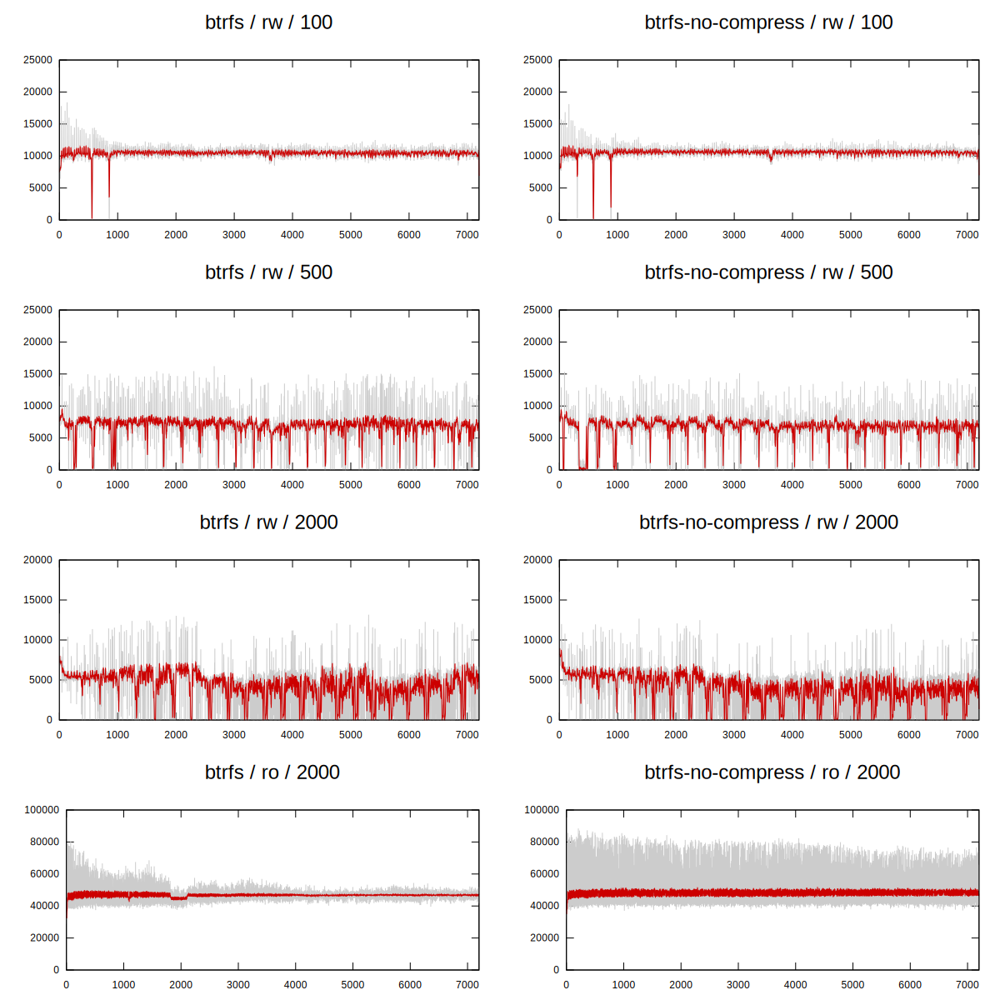
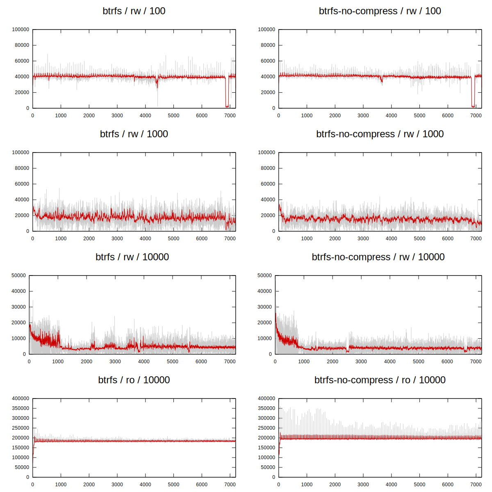

i5 / run-20231008-first-run
=========================

tps: [eps](i5/run-20231008-first-run/tps.eps) [svg](i5/run-20231008-first-run/tps.svg)

latencies: [eps](i5/run-20231008-first-run/latencies.eps) [svg](i5/run-20231008-first-run/latencies.svg)

| | btrfs | btrfs-no-compress | ext4 | xfs | zfs | zfs-no-compress | zfs-no-fpw |
|---|---|---|---|---|---|---|---|
|tps| [eps](i5/run-20231008-first-run/tps-btrfs.eps) [svg](i5/run-20231008-first-run/tps-btrfs.svg) | [eps](i5/run-20231008-first-run/tps-btrfs-no-compress.eps) [svg](i5/run-20231008-first-run/tps-btrfs-no-compress.svg) | [eps](i5/run-20231008-first-run/tps-ext4.eps) [svg](i5/run-20231008-first-run/tps-ext4.svg) | [eps](i5/run-20231008-first-run/tps-xfs.eps) [svg](i5/run-20231008-first-run/tps-xfs.svg) | [eps](i5/run-20231008-first-run/tps-zfs.eps) [svg](i5/run-20231008-first-run/tps-zfs.svg) | [eps](i5/run-20231008-first-run/tps-zfs-no-compress.eps) [svg](i5/run-20231008-first-run/tps-zfs-no-compress.svg) | [eps](i5/run-20231008-first-run/tps-zfs-no-fpw.eps) [svg](i5/run-20231008-first-run/tps-zfs-no-fpw.svg) |
|latency| [eps](i5/run-20231008-first-run/latencies-btrfs.eps) [svg](i5/run-20231008-first-run/latencies-btrfs.svg) | [eps](i5/run-20231008-first-run/latencies-btrfs-no-compress.eps) [svg](i5/run-20231008-first-run/latencies-btrfs-no-compress.svg) | [eps](i5/run-20231008-first-run/latencies-ext4.eps) [svg](i5/run-20231008-first-run/latencies-ext4.svg) | [eps](i5/run-20231008-first-run/latencies-xfs.eps) [svg](i5/run-20231008-first-run/latencies-xfs.svg) | [eps](i5/run-20231008-first-run/latencies-zfs.eps) [svg](i5/run-20231008-first-run/latencies-zfs.svg) | [eps](i5/run-20231008-first-run/latencies-zfs-no-compress.eps) [svg](i5/run-20231008-first-run/latencies-zfs-no-compress.svg) | [eps](i5/run-20231008-first-run/latencies-zfs-no-fpw.eps) [svg](i5/run-20231008-first-run/latencies-zfs-no-fpw.svg) |

i5 / run-20231011-lvm
=========================

tps: [eps](i5/run-20231011-lvm/tps.eps) [svg](i5/run-20231011-lvm/tps.svg)

latencies: [eps](i5/run-20231011-lvm/latencies.eps) [svg](i5/run-20231011-lvm/latencies.svg)

| | ext4 | xfs |
|---|---|---|
|tps| [eps](i5/run-20231011-lvm/tps-ext4.eps) [svg](i5/run-20231011-lvm/tps-ext4.svg) | [eps](i5/run-20231011-lvm/tps-xfs.eps) [svg](i5/run-20231011-lvm/tps-xfs.svg) |
|latency| [eps](i5/run-20231011-lvm/latencies-ext4.eps) [svg](i5/run-20231011-lvm/latencies-ext4.svg) | [eps](i5/run-20231011-lvm/latencies-xfs.eps) [svg](i5/run-20231011-lvm/latencies-xfs.svg) |

i5 / run-20231012-lvm-snap
=========================

tps: [eps](i5/run-20231012-lvm-snap/tps.eps) [svg](i5/run-20231012-lvm-snap/tps.svg)

latencies: [eps](i5/run-20231012-lvm-snap/latencies.eps) [svg](i5/run-20231012-lvm-snap/latencies.svg)

| | btrfs | btrfs-no-compress | ext4 | xfs |
|---|---|---|---|---|
|tps| [eps](i5/run-20231012-lvm-snap/tps-btrfs.eps) [svg](i5/run-20231012-lvm-snap/tps-btrfs.svg) | [eps](i5/run-20231012-lvm-snap/tps-btrfs-no-compress.eps) [svg](i5/run-20231012-lvm-snap/tps-btrfs-no-compress.svg) | [eps](i5/run-20231012-lvm-snap/tps-ext4.eps) [svg](i5/run-20231012-lvm-snap/tps-ext4.svg) | [eps](i5/run-20231012-lvm-snap/tps-xfs.eps) [svg](i5/run-20231012-lvm-snap/tps-xfs.svg) |
|latency| [eps](i5/run-20231012-lvm-snap/latencies-btrfs.eps) [svg](i5/run-20231012-lvm-snap/latencies-btrfs.svg) | [eps](i5/run-20231012-lvm-snap/latencies-btrfs-no-compress.eps) [svg](i5/run-20231012-lvm-snap/latencies-btrfs-no-compress.svg) | [eps](i5/run-20231012-lvm-snap/latencies-ext4.eps) [svg](i5/run-20231012-lvm-snap/latencies-ext4.svg) | [eps](i5/run-20231012-lvm-snap/latencies-xfs.eps) [svg](i5/run-20231012-lvm-snap/latencies-xfs.svg) |

i5 / run-20231013-btrfs-snap
=========================

tps: [eps](i5/run-20231013-btrfs-snap/tps.eps) [svg](i5/run-20231013-btrfs-snap/tps.svg)

latencies: [eps](i5/run-20231013-btrfs-snap/latencies.eps) [svg](i5/run-20231013-btrfs-snap/latencies.svg)

| | btrfs | btrfs-no-compress |
|---|---|---|
|tps| [eps](i5/run-20231013-btrfs-snap/tps-btrfs.eps) [svg](i5/run-20231013-btrfs-snap/tps-btrfs.svg) | [eps](i5/run-20231013-btrfs-snap/tps-btrfs-no-compress.eps) [svg](i5/run-20231013-btrfs-snap/tps-btrfs-no-compress.svg) |
|latency| [eps](i5/run-20231013-btrfs-snap/latencies-btrfs.eps) [svg](i5/run-20231013-btrfs-snap/latencies-btrfs.svg) | [eps](i5/run-20231013-btrfs-snap/latencies-btrfs-no-compress.eps) [svg](i5/run-20231013-btrfs-snap/latencies-btrfs-no-compress.svg) |

i5 / run-20231014-zfs-snap
=========================

tps: [eps](i5/run-20231014-zfs-snap/tps.eps) [svg](i5/run-20231014-zfs-snap/tps.svg)

latencies: [eps](i5/run-20231014-zfs-snap/latencies.eps) [svg](i5/run-20231014-zfs-snap/latencies.svg)

| | zfs | zfs-no-compress | zfs-no-fpw |
|---|---|---|---|
|tps| [eps](i5/run-20231014-zfs-snap/tps-zfs.eps) [svg](i5/run-20231014-zfs-snap/tps-zfs.svg) | [eps](i5/run-20231014-zfs-snap/tps-zfs-no-compress.eps) [svg](i5/run-20231014-zfs-snap/tps-zfs-no-compress.svg) | [eps](i5/run-20231014-zfs-snap/tps-zfs-no-fpw.eps) [svg](i5/run-20231014-zfs-snap/tps-zfs-no-fpw.svg) |
|latency| [eps](i5/run-20231014-zfs-snap/latencies-zfs.eps) [svg](i5/run-20231014-zfs-snap/latencies-zfs.svg) | [eps](i5/run-20231014-zfs-snap/latencies-zfs-no-compress.eps) [svg](i5/run-20231014-zfs-snap/latencies-zfs-no-compress.svg) | [eps](i5/run-20231014-zfs-snap/latencies-zfs-no-fpw.eps) [svg](i5/run-20231014-zfs-snap/latencies-zfs-no-fpw.svg) |

i5 / run-20231015-btrfs-native
=========================

tps: [eps](i5/run-20231015-btrfs-native/tps.eps) [svg](i5/run-20231015-btrfs-native/tps.svg)

latencies: [eps](i5/run-20231015-btrfs-native/latencies.eps) [svg](i5/run-20231015-btrfs-native/latencies.svg)

| | btrfs | btrfs-no-compress |
|---|---|---|
|tps| [eps](i5/run-20231015-btrfs-native/tps-btrfs.eps) [svg](i5/run-20231015-btrfs-native/tps-btrfs.svg) | [eps](i5/run-20231015-btrfs-native/tps-btrfs-no-compress.eps) [svg](i5/run-20231015-btrfs-native/tps-btrfs-no-compress.svg) |
|latency| [eps](i5/run-20231015-btrfs-native/latencies-btrfs.eps) [svg](i5/run-20231015-btrfs-native/latencies-btrfs.svg) | [eps](i5/run-20231015-btrfs-native/latencies-btrfs-no-compress.eps) [svg](i5/run-20231015-btrfs-native/latencies-btrfs-no-compress.svg) |

i5 / run-20231016-zfs-native-snap
=========================

tps: [eps](i5/run-20231016-zfs-native-snap/tps.eps) [svg](i5/run-20231016-zfs-native-snap/tps.svg)

latencies: [eps](i5/run-20231016-zfs-native-snap/latencies.eps) [svg](i5/run-20231016-zfs-native-snap/latencies.svg)

| | zfs | zfs-no-compress | zfs-no-fpw |
|---|---|---|---|
|tps| [eps](i5/run-20231016-zfs-native-snap/tps-zfs.eps) [svg](i5/run-20231016-zfs-native-snap/tps-zfs.svg) | [eps](i5/run-20231016-zfs-native-snap/tps-zfs-no-compress.eps) [svg](i5/run-20231016-zfs-native-snap/tps-zfs-no-compress.svg) | [eps](i5/run-20231016-zfs-native-snap/tps-zfs-no-fpw.eps) [svg](i5/run-20231016-zfs-native-snap/tps-zfs-no-fpw.svg) |
|latency| [eps](i5/run-20231016-zfs-native-snap/latencies-zfs.eps) [svg](i5/run-20231016-zfs-native-snap/latencies-zfs.svg) | [eps](i5/run-20231016-zfs-native-snap/latencies-zfs-no-compress.eps) [svg](i5/run-20231016-zfs-native-snap/latencies-zfs-no-compress.svg) | [eps](i5/run-20231016-zfs-native-snap/latencies-zfs-no-fpw.eps) [svg](i5/run-20231016-zfs-native-snap/latencies-zfs-no-fpw.svg) |

i5 / run-20231017-btrfs-native-snap
=========================

tps: [eps](i5/run-20231017-btrfs-native-snap/tps.eps) [svg](i5/run-20231017-btrfs-native-snap/tps.svg)

latencies: [eps](i5/run-20231017-btrfs-native-snap/latencies.eps) [svg](i5/run-20231017-btrfs-native-snap/latencies.svg)

| | btrfs | btrfs-no-compress |
|---|---|---|
|tps| [eps](i5/run-20231017-btrfs-native-snap/tps-btrfs.eps) [svg](i5/run-20231017-btrfs-native-snap/tps-btrfs.svg) | [eps](i5/run-20231017-btrfs-native-snap/tps-btrfs-no-compress.eps) [svg](i5/run-20231017-btrfs-native-snap/tps-btrfs-no-compress.svg) |
|latency| [eps](i5/run-20231017-btrfs-native-snap/latencies-btrfs.eps) [svg](i5/run-20231017-btrfs-native-snap/latencies-btrfs.svg) | [eps](i5/run-20231017-btrfs-native-snap/latencies-btrfs-no-compress.eps) [svg](i5/run-20231017-btrfs-native-snap/latencies-btrfs-no-compress.svg) |

i5 / run-20231018-zfs-native
=========================

tps: [eps](i5/run-20231018-zfs-native/tps.eps) [svg](i5/run-20231018-zfs-native/tps.svg)

latencies: [eps](i5/run-20231018-zfs-native/latencies.eps) [svg](i5/run-20231018-zfs-native/latencies.svg)

| | zfs | zfs-no-compress | zfs-no-fpw |
|---|---|---|---|
|tps| [eps](i5/run-20231018-zfs-native/tps-zfs.eps) [svg](i5/run-20231018-zfs-native/tps-zfs.svg) | [eps](i5/run-20231018-zfs-native/tps-zfs-no-compress.eps) [svg](i5/run-20231018-zfs-native/tps-zfs-no-compress.svg) | [eps](i5/run-20231018-zfs-native/tps-zfs-no-fpw.eps) [svg](i5/run-20231018-zfs-native/tps-zfs-no-fpw.svg) |
|latency| [eps](i5/run-20231018-zfs-native/latencies-zfs.eps) [svg](i5/run-20231018-zfs-native/latencies-zfs.svg) | [eps](i5/run-20231018-zfs-native/latencies-zfs-no-compress.eps) [svg](i5/run-20231018-zfs-native/latencies-zfs-no-compress.svg) | [eps](i5/run-20231018-zfs-native/latencies-zfs-no-fpw.eps) [svg](i5/run-20231018-zfs-native/latencies-zfs-no-fpw.svg) |

xeon / run-20231008-first-run
=========================

tps: [eps](xeon/run-20231008-first-run/tps.eps) [svg](xeon/run-20231008-first-run/tps.svg)

latencies: [eps](xeon/run-20231008-first-run/latencies.eps) [svg](xeon/run-20231008-first-run/latencies.svg)

| | btrfs | btrfs-no-compress | ext4 | xfs | zfs | zfs-no-compress | zfs-no-fpw |
|---|---|---|---|---|---|---|---|
|tps| [eps](xeon/run-20231008-first-run/tps-btrfs.eps) [svg](xeon/run-20231008-first-run/tps-btrfs.svg) | [eps](xeon/run-20231008-first-run/tps-btrfs-no-compress.eps) [svg](xeon/run-20231008-first-run/tps-btrfs-no-compress.svg) | [eps](xeon/run-20231008-first-run/tps-ext4.eps) [svg](xeon/run-20231008-first-run/tps-ext4.svg) | [eps](xeon/run-20231008-first-run/tps-xfs.eps) [svg](xeon/run-20231008-first-run/tps-xfs.svg) | [eps](xeon/run-20231008-first-run/tps-zfs.eps) [svg](xeon/run-20231008-first-run/tps-zfs.svg) | [eps](xeon/run-20231008-first-run/tps-zfs-no-compress.eps) [svg](xeon/run-20231008-first-run/tps-zfs-no-compress.svg) | [eps](xeon/run-20231008-first-run/tps-zfs-no-fpw.eps) [svg](xeon/run-20231008-first-run/tps-zfs-no-fpw.svg) |
|latency| [eps](xeon/run-20231008-first-run/latencies-btrfs.eps) [svg](xeon/run-20231008-first-run/latencies-btrfs.svg) | [eps](xeon/run-20231008-first-run/latencies-btrfs-no-compress.eps) [svg](xeon/run-20231008-first-run/latencies-btrfs-no-compress.svg) | [eps](xeon/run-20231008-first-run/latencies-ext4.eps) [svg](xeon/run-20231008-first-run/latencies-ext4.svg) | [eps](xeon/run-20231008-first-run/latencies-xfs.eps) [svg](xeon/run-20231008-first-run/latencies-xfs.svg) | [eps](xeon/run-20231008-first-run/latencies-zfs.eps) [svg](xeon/run-20231008-first-run/latencies-zfs.svg) | [eps](xeon/run-20231008-first-run/latencies-zfs-no-compress.eps) [svg](xeon/run-20231008-first-run/latencies-zfs-no-compress.svg) | [eps](xeon/run-20231008-first-run/latencies-zfs-no-fpw.eps) [svg](xeon/run-20231008-first-run/latencies-zfs-no-fpw.svg) |

xeon / run-20231011-lvm-noflush
=========================

tps: [eps](xeon/run-20231011-lvm-noflush/tps.eps) [svg](xeon/run-20231011-lvm-noflush/tps.svg)

latencies: [eps](xeon/run-20231011-lvm-noflush/latencies.eps) [svg](xeon/run-20231011-lvm-noflush/latencies.svg)

| | ext4 | xfs |
|---|---|---|
|tps| [eps](xeon/run-20231011-lvm-noflush/tps-ext4.eps) [svg](xeon/run-20231011-lvm-noflush/tps-ext4.svg) | [eps](xeon/run-20231011-lvm-noflush/tps-xfs.eps) [svg](xeon/run-20231011-lvm-noflush/tps-xfs.svg) |
|latency| [eps](xeon/run-20231011-lvm-noflush/latencies-ext4.eps) [svg](xeon/run-20231011-lvm-noflush/latencies-ext4.svg) | [eps](xeon/run-20231011-lvm-noflush/latencies-xfs.eps) [svg](xeon/run-20231011-lvm-noflush/latencies-xfs.svg) |

xeon / run-20231012-lvm
=========================

tps: [eps](xeon/run-20231012-lvm/tps.eps) [svg](xeon/run-20231012-lvm/tps.svg)

latencies: [eps](xeon/run-20231012-lvm/latencies.eps) [svg](xeon/run-20231012-lvm/latencies.svg)

| | btrfs | btrfs-no-compress | ext4 | xfs |
|---|---|---|---|---|
|tps| [eps](xeon/run-20231012-lvm/tps-btrfs.eps) [svg](xeon/run-20231012-lvm/tps-btrfs.svg) | [eps](xeon/run-20231012-lvm/tps-btrfs-no-compress.eps) [svg](xeon/run-20231012-lvm/tps-btrfs-no-compress.svg) | [eps](xeon/run-20231012-lvm/tps-ext4.eps) [svg](xeon/run-20231012-lvm/tps-ext4.svg) | [eps](xeon/run-20231012-lvm/tps-xfs.eps) [svg](xeon/run-20231012-lvm/tps-xfs.svg) |
|latency| [eps](xeon/run-20231012-lvm/latencies-btrfs.eps) [svg](xeon/run-20231012-lvm/latencies-btrfs.svg) | [eps](xeon/run-20231012-lvm/latencies-btrfs-no-compress.eps) [svg](xeon/run-20231012-lvm/latencies-btrfs-no-compress.svg) | [eps](xeon/run-20231012-lvm/latencies-ext4.eps) [svg](xeon/run-20231012-lvm/latencies-ext4.svg) | [eps](xeon/run-20231012-lvm/latencies-xfs.eps) [svg](xeon/run-20231012-lvm/latencies-xfs.svg) |

xeon / run-20231014-lvm-snap
=========================

tps: [eps](xeon/run-20231014-lvm-snap/tps.eps) [svg](xeon/run-20231014-lvm-snap/tps.svg)

latencies: [eps](xeon/run-20231014-lvm-snap/latencies.eps) [svg](xeon/run-20231014-lvm-snap/latencies.svg)

| | btrfs | btrfs-no-compress | ext4 | xfs |
|---|---|---|---|---|
|tps| [eps](xeon/run-20231014-lvm-snap/tps-btrfs.eps) [svg](xeon/run-20231014-lvm-snap/tps-btrfs.svg) | [eps](xeon/run-20231014-lvm-snap/tps-btrfs-no-compress.eps) [svg](xeon/run-20231014-lvm-snap/tps-btrfs-no-compress.svg) | [eps](xeon/run-20231014-lvm-snap/tps-ext4.eps) [svg](xeon/run-20231014-lvm-snap/tps-ext4.svg) | [eps](xeon/run-20231014-lvm-snap/tps-xfs.eps) [svg](xeon/run-20231014-lvm-snap/tps-xfs.svg) |
|latency| [eps](xeon/run-20231014-lvm-snap/latencies-btrfs.eps) [svg](xeon/run-20231014-lvm-snap/latencies-btrfs.svg) | [eps](xeon/run-20231014-lvm-snap/latencies-btrfs-no-compress.eps) [svg](xeon/run-20231014-lvm-snap/latencies-btrfs-no-compress.svg) | [eps](xeon/run-20231014-lvm-snap/latencies-ext4.eps) [svg](xeon/run-20231014-lvm-snap/latencies-ext4.svg) | [eps](xeon/run-20231014-lvm-snap/latencies-xfs.eps) [svg](xeon/run-20231014-lvm-snap/latencies-xfs.svg) |

xeon / run-20231015-btrfs
=========================

tps: [eps](xeon/run-20231015-btrfs/tps.eps) [svg](xeon/run-20231015-btrfs/tps.svg)

latencies: [eps](xeon/run-20231015-btrfs/latencies.eps) [svg](xeon/run-20231015-btrfs/latencies.svg)

| | btrfs | btrfs-no-compress |
|---|---|---|
|tps| [eps](xeon/run-20231015-btrfs/tps-btrfs.eps) [svg](xeon/run-20231015-btrfs/tps-btrfs.svg) | [eps](xeon/run-20231015-btrfs/tps-btrfs-no-compress.eps) [svg](xeon/run-20231015-btrfs/tps-btrfs-no-compress.svg) |
|latency| [eps](xeon/run-20231015-btrfs/latencies-btrfs.eps) [svg](xeon/run-20231015-btrfs/latencies-btrfs.svg) | [eps](xeon/run-20231015-btrfs/latencies-btrfs-no-compress.eps) [svg](xeon/run-20231015-btrfs/latencies-btrfs-no-compress.svg) |

xeon / run-20231016-zfs
=========================

tps: [eps](xeon/run-20231016-zfs/tps.eps) [svg](xeon/run-20231016-zfs/tps.svg)

latencies: [eps](xeon/run-20231016-zfs/latencies.eps) [svg](xeon/run-20231016-zfs/latencies.svg)

| | zfs | zfs-no-compress | zfs-no-fpw |
|---|---|---|---|
|tps| [eps](xeon/run-20231016-zfs/tps-zfs.eps) [svg](xeon/run-20231016-zfs/tps-zfs.svg) | [eps](xeon/run-20231016-zfs/tps-zfs-no-compress.eps) [svg](xeon/run-20231016-zfs/tps-zfs-no-compress.svg) | [eps](xeon/run-20231016-zfs/tps-zfs-no-fpw.eps) [svg](xeon/run-20231016-zfs/tps-zfs-no-fpw.svg) |
|latency| [eps](xeon/run-20231016-zfs/latencies-zfs.eps) [svg](xeon/run-20231016-zfs/latencies-zfs.svg) | [eps](xeon/run-20231016-zfs/latencies-zfs-no-compress.eps) [svg](xeon/run-20231016-zfs/latencies-zfs-no-compress.svg) | [eps](xeon/run-20231016-zfs/latencies-zfs-no-fpw.eps) [svg](xeon/run-20231016-zfs/latencies-zfs-no-fpw.svg) |

xeon / run-20231017-kingston-first-run
=========================

tps: [eps](xeon/run-20231017-kingston-first-run/tps.eps) [svg](xeon/run-20231017-kingston-first-run/tps.svg)

latencies: [eps](xeon/run-20231017-kingston-first-run/latencies.eps) [svg](xeon/run-20231017-kingston-first-run/latencies.svg)

| | btrfs | btrfs-no-compress | ext4 | xfs | zfs | zfs-no-compress | zfs-no-fpw |
|---|---|---|---|---|---|---|---|
|tps| [eps](xeon/run-20231017-kingston-first-run/tps-btrfs.eps) [svg](xeon/run-20231017-kingston-first-run/tps-btrfs.svg) | [eps](xeon/run-20231017-kingston-first-run/tps-btrfs-no-compress.eps) [svg](xeon/run-20231017-kingston-first-run/tps-btrfs-no-compress.svg) | [eps](xeon/run-20231017-kingston-first-run/tps-ext4.eps) [svg](xeon/run-20231017-kingston-first-run/tps-ext4.svg) | [eps](xeon/run-20231017-kingston-first-run/tps-xfs.eps) [svg](xeon/run-20231017-kingston-first-run/tps-xfs.svg) | [eps](xeon/run-20231017-kingston-first-run/tps-zfs.eps) [svg](xeon/run-20231017-kingston-first-run/tps-zfs.svg) | [eps](xeon/run-20231017-kingston-first-run/tps-zfs-no-compress.eps) [svg](xeon/run-20231017-kingston-first-run/tps-zfs-no-compress.svg) | [eps](xeon/run-20231017-kingston-first-run/tps-zfs-no-fpw.eps) [svg](xeon/run-20231017-kingston-first-run/tps-zfs-no-fpw.svg) |
|latency| [eps](xeon/run-20231017-kingston-first-run/latencies-btrfs.eps) [svg](xeon/run-20231017-kingston-first-run/latencies-btrfs.svg) | [eps](xeon/run-20231017-kingston-first-run/latencies-btrfs-no-compress.eps) [svg](xeon/run-20231017-kingston-first-run/latencies-btrfs-no-compress.svg) | [eps](xeon/run-20231017-kingston-first-run/latencies-ext4.eps) [svg](xeon/run-20231017-kingston-first-run/latencies-ext4.svg) | [eps](xeon/run-20231017-kingston-first-run/latencies-xfs.eps) [svg](xeon/run-20231017-kingston-first-run/latencies-xfs.svg) | [eps](xeon/run-20231017-kingston-first-run/latencies-zfs.eps) [svg](xeon/run-20231017-kingston-first-run/latencies-zfs.svg) | [eps](xeon/run-20231017-kingston-first-run/latencies-zfs-no-compress.eps) [svg](xeon/run-20231017-kingston-first-run/latencies-zfs-no-compress.svg) | [eps](xeon/run-20231017-kingston-first-run/latencies-zfs-no-fpw.eps) [svg](xeon/run-20231017-kingston-first-run/latencies-zfs-no-fpw.svg) |

